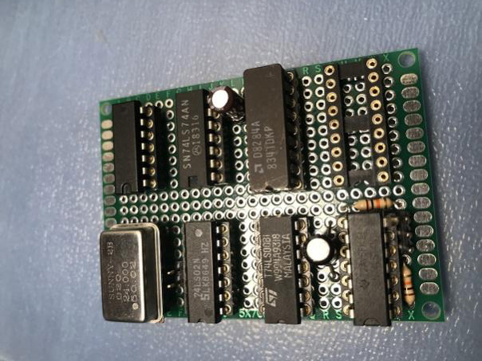

## PC-SPRINT v2

Building on the work of Doug Severson in 1985, the PC-SPRINT v2 is an updated and improved DIY overclocking device for 8088-based systems. Please see the [PC-SPRINT README](/blob/master/README.md) for an introduction to the original device.

With the potential for DMA-related problems I decided that it would be worth attempting to improve the design of the PC-SPRINT. Although I haven't run into these problems myself and I'm not sure how I'll test it, it will be a fun project and an opportunity to teach myself some things about KiCAD, PCB fabrication and early PCs. With all that in mind, the PC-SPRINT v2 will aim to seamlessly switch back to the stock clock speed whenever there is DMA activity, eliminating the possibility of lockups.

To understand why and how, we'll start with a quick history lesson.

In 2014 fellow VCFed forum user [Sergey Kiselev](https://github.com/skiselev), author of various high profile 8088 and Z80 hardware projects, analysed the PC-SPRINT and [observed](http://www.vcfed.org/forum/showthread.php?41940-IBM-XT-cpu-upgrade&p=319044#post319044) that it didn't disable the turbo mode when the system was performing DMA activity, as per other "turbo" PC clones. [DMA or "Direct Memory Access"](https://en.wikipedia.org/wiki/Direct_memory_access) is a way for devices to read and write directly to RAM, bypassing the CPU. If the device in question isn't designed to take account of the CPU running at a different clock speed to the rest of the system this can result in potential problems. Based on this, Sergey went on to design and release his own solution, the [Turbo 8088](References/Turbo%208088%20-%20Schematic.pdf), based on his [Xi 8088](http://www.malinov.com/Home/sergeys-projects/xi-8088) ISA processor board.

In 2019, yet another VCFed forum user, inmbolmie, [decided to build one](http://www.vcfed.org/forum/showthread.php?70923-IBM-5160-overclock-Sergey%92s-way), as well as fixing some bugs in Sergey's design. The updated version was dubbed the [Turbo8088 v2](../References/turbo8088%20v2.pdf). The board was successfully tested in a 5160 at up to 25MHz giving an 8.33MHz CPU clock speed. Over this speed various problems were reported.

As you can see, the Turbo8088 is a large design that adds a lot of components and complexity. I don't want to tread on Sergey's toes as he's one of the best when it comes to systems architecture and electronics but I decided to see whether it would be possible to incorporate the DMA signals Sergey identified into the PC-SPRINT, making for a simple and compact hybrid solution.

I believe that I have succeeded in this, and my PC-SPRINT v2 prototypes are currently being tested.

As this started life as a freely available project it only seemed right to release the PC-SPRINT v2 under the GPL. The package includes the KiCAD and gerber files for PCB fabrication. Once the boards are manufactured and tested I will update this repo with further information.

The PC-SPRINT v2 files are available [here](KiCAD).

### DMA Signals on the 5150 Motherboard

In my early research I came to the conclusion that these signals wouldn't be available on the 5150, but after a lot more reading and consulting the [IBM Technical Reference](References/IBM_5150_Technical_Reference_6322507_APR84.pdf), I believe that we can actually pick them up from very similar places to Sergey's design for the 5160. The Turbo8088 and indeed the PC-SPRINT v2 would then be able to incorporate the following:

- HRQDMA: From pin 10 of the 8237 DMA controller IC. This pin goes HIGH on DMA activity.
- HRQWAIT / DMAWAIT: From pin 7 of an 74LS175 "flip flop" IC labeled U88 on the XT, however I am yet to identify its location on the 5150. The most likely candidate is U26 (next to the DIP switches) but this needs to be confirmed before we hook anything up to it. As above, this pin also goes HIGH on DMA activity.

These inputs are connected to an OR gate and an inverter. When combined with an AND gate on the turbo switch, this should give us the required logic to switch to the lower clock speed if either of these inputs go HIGH. In the spirit of the original design I have implemented this logic using discrete components, but it could be easily adapted to use [7400 series TTL](https://en.wikipedia.org/wiki/List_of_7400-series_integrated_circuits) instead if you're so inclined.

Original circuit on the left, new additions on the right.